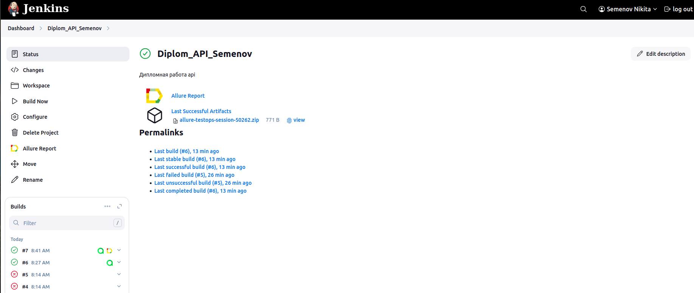
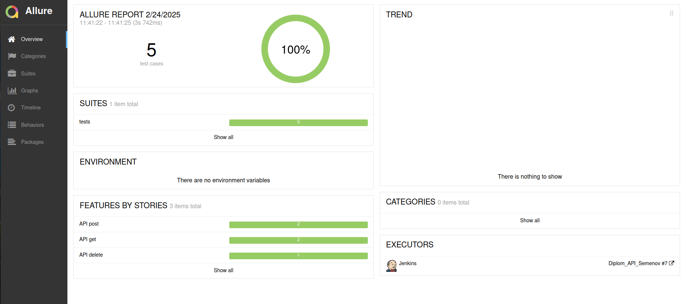
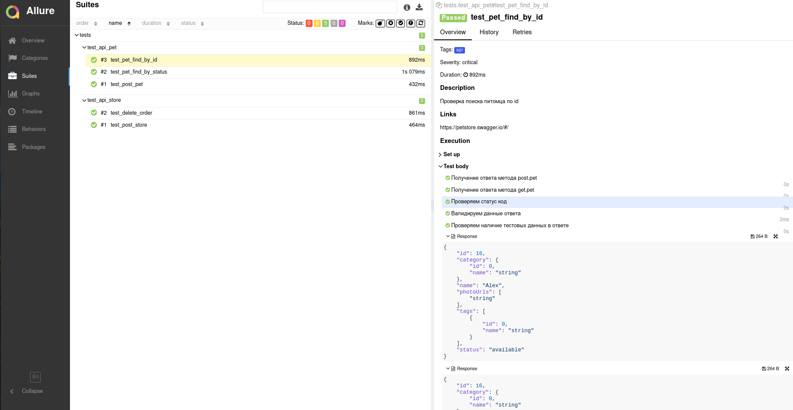
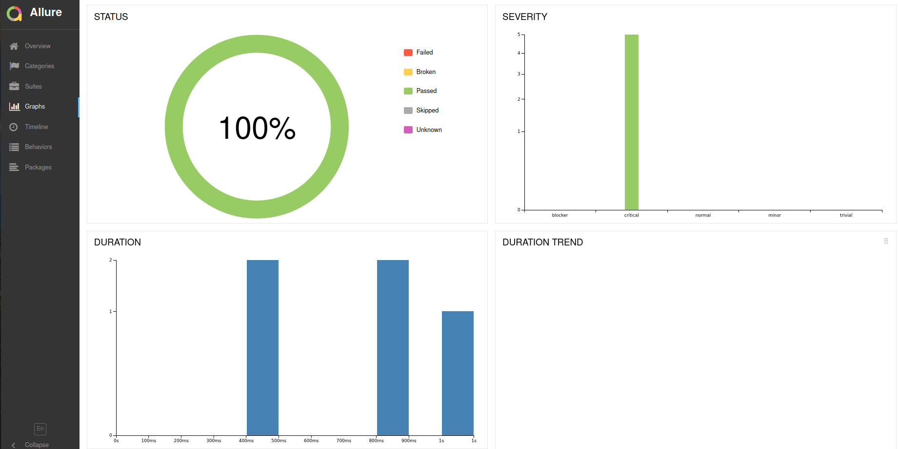
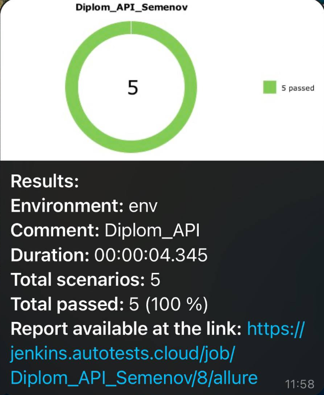

# Проект по автоматизации тестирования Gismeteo Api Petstore
<a target="_blank" href="https://petstore.swagger.io/">Сайт проекта</a>

## 📄 Содержание
- [Технологии и инструменты](#tech_and_ins-технологии-и-инструменты)
- [Примеры API тестов](#scroll-Примеры-API-тестов)
- [Сборка в Jenkins](#-Сборка-в-Jenkins)
- [Allure отчет](#-Allure-отчет)
- [Отчет в Telegram с помощью бота](#-Отчет-в-Telegram-с-помощью-бота)

## :wrench: Технологии и инструменты

В данном проекте автотесты написаны на <code>Python</code> с использованием <code>Pytest</code> для UI-тестов и библиотекой <code>Requests</code>

> <code>Allure Report</code> формирует отчет о запуске тестов.
>
> <code>Jenkins</code> выполняет запуск тестов.
> После завершения прогона отправляются уведомления с помощью бота в <code>Telegram</code>.

## :pager: Примеры API тестов

- Валидирование ответов
- Проверка статус кода
- Проверка данных ответа

Данные примеры применимы к метода Post, Get, а также Delete

## </a> Сборка в Jenkins

> Запуск джоба происходит по нажатию кнопки <code>Build now</code>

## </a> Allure отчет
>
> Allure формирует подробный отчет о прогоне тестов. Кастомные фильтры и листенеры делают отчет максимально понятным.
> Отчёт также сопровождается данными ответа и логами

##  Отчет в Telegram с помощью бота
>
> После прогона всех тестов в <code>Telegram</code> чат автоматически приходит сообщение с полной информацией о прогоне и ссылкой на <code>Allure</code>
>

